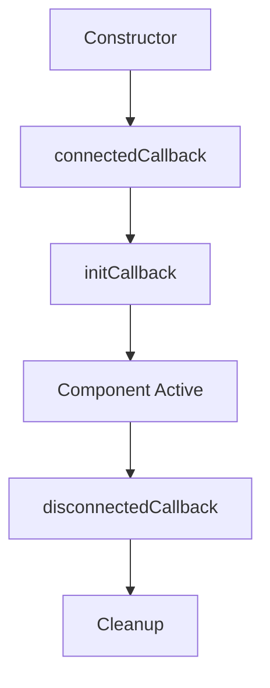

The File Uploader is built on a component-based architecture using Web Components. This guide explains how components are structured, how they communicate, and how you can build custom solutions.

## Component Hierarchy

The File Uploader uses a hierarchical component system with three main layers:

```
Solution Blocks (FileUploaderRegular, FileUploaderInline, etc.)
    ↓
Uploader Blocks (UploadList, SourceList, etc.)
    ↓
Base Blocks (Icon, Button, Modal, etc.)
```

### Base: LitBlock

All components extend from `LitBlock`, which provides core functionality:

From `src/lit/LitBlock.ts:35-52`:

```typescript
export class LitBlock extends LitBlockBase {
  private _cfgProxy!: ConfigType;
  protected _sharedContextInstances: Map<keyof SharedInstancesState, ISharedInstance> = new Map();

  public static styleAttrs: string[] = [];
  public activityType: ActivityType = null;
  public init$ = blockCtx();

  public l10n = createL10n(() => this.sharedCtx);
  public debugPrint = createDebugPrinter(() => this.sharedCtx, this.constructor.name);
  protected _sharedInstancesBag = createSharedInstancesBag(() => this.sharedCtx);
}
```

**Key features:**
- State management via reactive context
- Localization support (l10n)
- Shared instance management
- Debug utilities
- Accessibility features

### Uploader Block

`LitUploaderBlock` extends `LitActivityBlock` and adds upload-specific functionality:

From `src/lit/LitUploaderBlock.ts:24-35`:

```typescript
export class LitUploaderBlock extends LitActivityBlock {
  public static extSrcList: Readonly<typeof ExternalUploadSource>;
  public static sourceTypes: Readonly<typeof UploadSource>;
  protected couldBeCtxOwner = false;

  private _isCtxOwner = false;
  private _unobserveCollection?: () => void;
  private _unobserveCollectionProperties?: () => void;

  public override init$ = uploaderBlockCtx(this);
}
```

**Key features:**
- Upload collection management
- File validation
- Upload queue control
- Event emission
- API access

### Solution Block

`LitSolutionBlock` is the top-level container for complete solutions:

From `src/lit/LitSolutionBlock.ts:7-21`:

```typescript
export class LitSolutionBlock extends LitBlock {
  public static override styleAttrs = ['uc-wgt-common'];
  public override init$ = solutionBlockCtx(this);

  public override initCallback(): void {
    super.initCallback();
    this.a11y?.registerBlock(this);
    this.clipboardLayer?.registerBlock(this);
    this.sharedCtx.pub('*solution', this.tagName);
  }
}
```

**Key features:**
- Complete uploader experience
- Pre-configured component composition
- Theme support
- Clipboard integration

## Core Components

### Config Component

Manages all configuration options and propagates changes:

```html
<uc-config
  pubkey="your_public_key"
  multiple="true"
  source-list="local, camera"
></uc-config>
```

See [Configuration System](/concepts/configuration) for details.

### UploadCtxProvider

Provides shared context for upload operations:

```html
<uc-upload-ctx-provider ctx-name="my-uploader">
  <!-- All child components share this context -->
</uc-upload-ctx-provider>
```

### Modal Component

Containers for activities that appear in modal dialogs:

```html
<uc-modal id="start-from" strokes block-body-scrolling>
  <uc-start-from>
    <!-- Modal content -->
  </uc-start-from>
</uc-modal>
```

### Upload Sources

Components for different file upload sources:

<CardGroup cols={2}>
  <Card title="DropArea" icon="download">
    Drag-and-drop zone for local files
    
    ```html
    <uc-drop-area 
      with-icon 
      clickable
    ></uc-drop-area>
    ```
  </Card>
  
  <Card title="CameraSource" icon="camera">
    Camera/webcam capture interface
    
    ```html
    <uc-camera-source></uc-camera-source>
    ```
  </Card>
  
  <Card title="UrlSource" icon="link">
    Upload files from URLs
    
    ```html
    <uc-url-source></uc-url-source>
    ```
  </Card>
  
  <Card title="ExternalSource" icon="cloud">
    External services (Dropbox, Google Drive, etc.)
    
    ```html
    <uc-external-source></uc-external-source>
    ```
  </Card>
</CardGroup>

### UploadList Component

Displays and manages uploaded files:

```html
<uc-upload-list></uc-upload-list>
```

### SourceList Component

Displays available upload sources as buttons:

```html
<uc-source-list role="list" wrap></uc-source-list>
```

## Component Registration

Components are automatically registered as custom elements using a naming convention:

From `src/abstract/defineComponents.ts:3-26`:

```typescript
export function defineComponents(blockExports: Record<string, any>) {
  for (const blockName in blockExports) {
    if (EXCLUDE_COMPONENTS.includes(blockName)) {
      continue;
    }
    let tagName = [...blockName].reduce((name, char) => {
      if (char.toUpperCase() === char) {
        char = `-${char.toLowerCase()}`;
      }
      name += char;
      return name;
    }, '');
    if (tagName.startsWith('-')) {
      tagName = tagName.replace('-', '');
    }
    
    if (!tagName.startsWith('uc-')) {
      tagName = `uc-${tagName}`;
    }
    if (blockExports[blockName].reg) {
      blockExports[blockName].reg(tagName);
    }
  }
}
```

**Examples:**
- `FileUploaderRegular` → `uc-file-uploader-regular`
- `UploadList` → `uc-upload-list`
- `CameraSource` → `uc-camera-source`

## State Management

Components use a reactive state system based on `TypedData`:

From `src/abstract/TypedData.ts:7-30`:

```typescript
export class TypedData<T extends Record<string, unknown>> {
  private _ctxId: Uid;
  private _data: PubSub<T>;

  public setValue<K extends keyof T>(prop: K, value: T[K]): void {
    if (!this._data.has(prop)) {
      console.warn(`${MSG_NAME}${String(prop)}`);
      return;
    }

    const isChanged = this._data.read(prop) !== value;
    if (isChanged) {
      this._data.pub(prop, value);
    }
  }

  public getValue<K extends keyof T>(prop: K): T[K] {
    if (!this._data.has(prop)) {
      console.warn(`${MSG_NAME}${String(prop)}`);
    }
    return this._data.read(prop);
  }
}
```

### Subscribing to State Changes

Components can subscribe to state changes:

```javascript
// Subscribe to configuration changes
this.sub('*currentActivity', (activity) => {
  console.log('Activity changed:', activity);
});

// Subscribe to upload collection changes
this.sub('*uploadList', (files) => {
  console.log('Files changed:', files);
});
```

### Publishing State Changes

Components can publish state changes:

```javascript
// Change the current activity
this.$['*currentActivity'] = 'upload-list';

// Update upload progress
this.$['*commonProgress'] = 50;
```

## Shared Instances

Certain functionality is shared across all components in a context:

<Tabs>
  <Tab title="Event Emitter">
    Handles all uploader events:
    
    ```javascript
    this.emit(EventType.FILE_ADDED, fileEntry);
    this.emit(EventType.UPLOAD_PROGRESS, progressData);
    ```
  </Tab>
  
  <Tab title="Upload Collection">
    Manages the collection of files being uploaded:
    
    ```javascript
    this.uploadCollection.add(fileData);
    this.uploadCollection.remove(fileId);
    this.uploadCollection.items();
    ```
  </Tab>
  
  <Tab title="Modal Manager">
    Controls modal dialogs:
    
    ```javascript
    this.modalManager.open('start-from');
    this.modalManager.close('upload-list');
    ```
  </Tab>
  
  <Tab title="Validation Manager">
    Runs file and collection validators:
    
    ```javascript
    this.validationManager.runFileValidators('add', [fileId]);
    this.validationManager.runCollectionValidators();
    ```
  </Tab>
</Tabs>

## Building Custom Components

You can create custom components by extending the base classes:

### Custom Block

```javascript
import { Block } from '@uploadcare/file-uploader';
import { html } from 'lit';

export class MyCustomBlock extends Block {
  static styleAttrs = ['my-custom-block'];
  
  initCallback() {
    super.initCallback();
    
    // Subscribe to configuration
    this.subConfigValue('pubkey', (pubkey) => {
      console.log('Public key:', pubkey);
    });
    
    // Subscribe to upload list
    this.sub('*uploadList', (files) => {
      console.log('Files:', files);
    });
  }
  
  render() {
    return html`
      <div class="my-custom-block">
        <slot></slot>
      </div>
    `;
  }
}

MyCustomBlock.reg('my-custom-block');
```

### Custom Solution

```javascript
import { SolutionBlock } from '@uploadcare/file-uploader';
import { html } from 'lit';

export class MyCustomSolution extends SolutionBlock {
  static styleAttrs = [
    ...SolutionBlock.styleAttrs,
    'my-custom-solution'
  ];
  
  render() {
    return html`
      ${super.render()}
      <uc-config 
        ctx-name="my-solution"
        pubkey="${this.pubkey}"
      ></uc-config>
      
      <uc-drop-area clickable></uc-drop-area>
      <uc-upload-list></uc-upload-list>
      
      <uc-modal id="camera">
        <uc-camera-source></uc-camera-source>
      </uc-modal>
    `;
  }
}

MyCustomSolution.reg('my-custom-solution');
```

## Component Communication

Components communicate through several mechanisms:

### 1. Shared State

All components in a context share reactive state:

```javascript
// Component A sets state
this.$['*currentActivity'] = 'camera';

// Component B subscribes to state
this.sub('*currentActivity', (activity) => {
  // Reacts to change
});
```

### 2. Events

Components emit events through the event emitter:

```javascript
// Emit event
this.emit(EventType.FILE_ADDED, fileData);

// Listen to event
api.on(EventType.FILE_ADDED, (file) => {
  console.log('File added:', file);
});
```

### 3. Public API

The public API provides methods for programmatic control:

```javascript
const api = uploader.getAPI();

api.addFileFromUrl('https://example.com/image.jpg');
api.uploadAll();
api.setCurrentActivity('upload-list');
```

## Component Lifecycle



### Lifecycle Hooks

```javascript
class MyComponent extends Block {
  constructor() {
    super();
    // Initialize instance properties
  }
  
  connectedCallback() {
    super.connectedCallback();
    // Component added to DOM
  }
  
  initCallback() {
    super.initCallback();
    // Component initialized
    // Set up subscriptions
  }
  
  disconnectedCallback() {
    super.disconnectedCallback();
    // Component removed from DOM
    // Clean up resources
  }
}
```

## Best Practices

<AccordionGroup>
  <Accordion title="Use shared context">
    Always use the shared context for state management rather than component-local state when data needs to be accessed by multiple components.
  </Accordion>
  
  <Accordion title="Clean up subscriptions">
    Unsubscribe from state changes in `disconnectedCallback` to prevent memory leaks.
  </Accordion>
  
  <Accordion title="Leverage composition">
    Build complex UIs by composing simple components rather than creating monolithic components.
  </Accordion>
  
  <Accordion title="Follow naming conventions">
    Use the `uc-` prefix for custom components to maintain consistency.
  </Accordion>
</AccordionGroup>

## Next Steps

<CardGroup cols={2}>
  <Card title="Configuration System" icon="gear" href="/concepts/configuration">
    Learn about configuration options
  </Card>
  
  <Card title="Solutions Overview" icon="puzzle-piece" href="/concepts/solutions">
    Explore pre-built solutions
  </Card>
</CardGroup>
